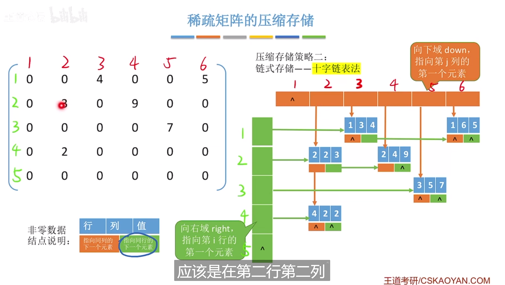

# 特殊矩阵的压缩存储

## 一 、一维数组的存储结构

ElemType a[10];

```
内存		【a[0]|a[1]|a[2]......|a[10]】
		   ^
起始地址	LOC
```

个数组元素**大小相同**，且物理上**连续存放**

数组a[i]的存放地址 = **LOC + i*sizeof(ElemType )  (0<=i<=10)**

ps.1:除非题目特别说明，否则**数组下标默认从0开始**

<!--more-->

## 二、二维数组的存储结构

ElemType b[2] [4] ; 

###### 逻辑视角

```
【b[0][0]|b[0][1]....|b[0][3]】
【b[1][0]|b[1][1]....|b[1][3]】
```

###### 行优先存储

```
内存		【b[0][0]|b[0][1]....|b[0][3]|b[1][0]|b[1][1]....|b[1][3]】
		   ^
起始地址	LOC
```

M行N列的二维数组b[M] [N]中，**行优先存储**

b [i] [j]的存储地址为 = **LOC +(i*N+j) *sizeof(ElemType )**

###### 列优先存储

```
内存		【b[0][0]|b[1][0]|b[0][1]|b[1][1]|b[0][2]|b[1][2]|....|b[0][3]|b[1][3]】
		   ^
起始地址	LOC
```

M行N列的二维数组b[M] [N]中，**列优先存储**

b [i] [j]的存储地址为 = **LOC +(J*M+I) *sizeof(ElemType )**


## 三、普通矩阵的存储

类型：

```
|----				-----|
|a1,1 a1,2 a1,3 .... a1,n|
|a2,1 a2,2 a2,3 .... a2,n|
|........................|
|am,1 am,2 am,3 .... am,n					
|----				-----|


```

**可用二维数组存储**

注：行列通常由1开始，数组下标通常从0开始；


## 四、对称矩阵（方阵）的压缩存储

### 1、定义

​	若n阶**方阵**中任意一个元素**ai,j都有ai,j=aj,i**。则称其为对称矩阵

### 2、普通存储

​	二维矩阵

### 3、压缩存储

​	**只存储对角线+下三角区**

​	按**行优先**原则将各元素存入**一维数组**中

```
【a1,1|a2,1|a2,2|....an,n-1|an,n】
```

​	按**列优先**原则将各元素存入**一维数组**中

```
【a1,1|a2,1|a3,1|....an,n-1|an,n】
```

###### 数组大小为：

```
	(1+n)*n/2
```

###### an,n对应的数组下标为：

```
	n(n+1)/2 - 1(数组下标从0开始)
```

### 4、下标映射

###### 需要一个“映射”函数，在数组从0开始的情况下（行优先）

```
	矩阵下标=》一维数组下标

 	k = i(i-1)/2 +j - 1(从1开始就不需要减1)  a[i] [j] (i>=j) =》b[k]
 	k = j(j-1)/2 +i -1					  a[i] [j] (i< j) =》b[k]
```

###### **需要一个“映射”函数，在数组从0开始的情况下（列优先）**

	矩阵下标=》一维数组下标
	
	k = (n+n-j+2)(j-1)/2+i-j			  		  a[i] [j] (i>=j) =》b[k]
	k = (n+n-i+2)(i-1)/2+j-i					  a[i] [j] (i< j) =》b[k]

​	**从1开始**

```
k = (n + n - (j - 1) + 2) * (j - 1) / 2 + i - j 	a[i] [j] (i>=j) =》b[k]
k = (n + n - (i - 1) + 2) * (i - 1) / 2 + j - i		a[i] [j] (i< j) =》b[k]
```


## 五、三角矩阵（方阵）的压缩存储

### 1、定义

**下三角矩阵**

除了主对角线和**下三角区**，其余元素**相等**


**上三角矩阵**

除了主对角线和**上三角区**，其余元素**相等**

### 2、存储策略

按**行优先**原则将**不重复区**元素存入**一维数组**中。并在**最后一个**位置存储常量c

###### 数组大小为：

```
	(1+n)*n/2 + 1
```

### 3、下标映射(下三角矩阵)

###### 需要一个“映射”函数，在数组从0开始的情况下（行优先）

```
	矩阵下标=》一维数组下标

 	k = i(i-1)/2 +j - 1(从1开始就不需要减1)  a[i] [j] (i>=j) =》b[k]
 	k = n(n+1)/2  					  a[i] [j] (i< j) =》b[k]
```

###### **需要一个“映射”函数，在数组从0开始的情况下（列优先）**

	矩阵下标=》一维数组下标
	
	k = ((2 * n - j + 1) * j / 2) + i - j	      a[i] [j] (i>=j) =》b[k]
	k = n(n+1)/2					  			  a[i] [j] (i< j) =》b[k]

​	**从1开始**

```
k = ((2 * n - (j - 1) + 1) * j / 2) + i - j 	a[i] [j] (i>=j) =》b[k]
k = n(n+1)/2-1									a[i] [j] (i< j) =》b[k]
```

### 4、下标映射(上三角矩阵)

###### 需要一个“映射”函数，在数组从0开始的情况下（行优先）

```
	矩阵下标=》一维数组下标

 	k = (i-1)(2n-i+2)/2 + (j-i)  	  a[i] [j] (i<=j) =》b[k]
 	k = n(n+1)/2  					  a[i] [j] (i> j) =》b[k]
```

###### **需要一个“映射”函数，在数组从0开始的情况下（列优先）**

	矩阵下标=》一维数组下标
	
	k = ((2 * n - j + 1) * j / 2) + i - j	  	  a[i] [j] (i<=j) =》b[k]
	k = n(n+1)/2-1					 			  a[i] [j] (i> j) =》b[k]

​	**从1开始**

```
k = ((2 * n - (j - 1) + 1) * j / 2) + i - j 				a[i] [j] (i<=j) =》b[k]
k = n(n+1)/2										a[i] [j] (i> j) =》b[k]
```


## 六、三对角矩阵（带状矩阵）（方阵）的压缩存储

### 1、定义

当 **|i - j| > 1** 时，有 **ai,j =0;(1<=i,j<=n)**

### 2、存储策略

**只存储带状部分**

###### 数组大小为：

```
	3n-2
```

### 3、下标映射

###### 需要一个“映射”函数，在数组从0开始的情况下（行优先）

```
k = j + (i - j) * (n - j + 1) - 1
```

###### 反推i，j

```
j = (k + 1) % (n - 1)
i = k / (n - 1) + j + 1

```

###### **需要一个“映射”函数，在数组从0开始的情况下（列优先）**

```
k = i + (j - i) * (n - i + 1) - 1
```

###### 反推i，j

```
i = (k + 1) % (n - 1)
j = k / (n - 1) + i + 1
```

## 七、稀疏矩阵（可非方阵）的压缩存储

### 1、定义

**非0元素**数量远**小于矩阵元素**个数

### 2、存储策略

###### 顺序存储--三元组<行，列，值>

（不可随机存储，但简单）

###### 十字链表法--三元组<行，列，值>

